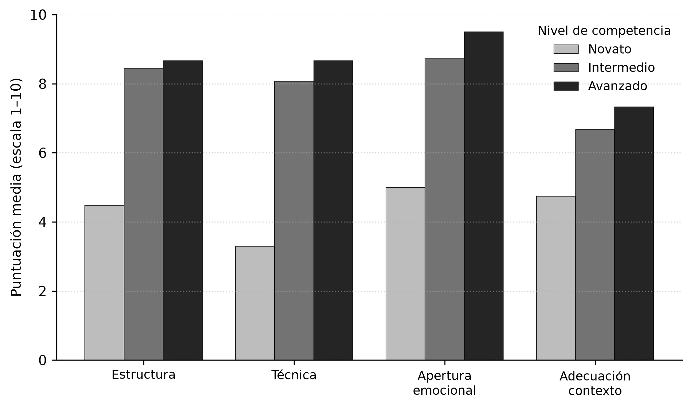

# CliniA: herramienta de inteligencia artificial para simular pacientes y fortalecer entrevistas psicológicas

*CliniA: an artificial-intelligence tool to simulate patients and strengthen psychological interviews*

**Running title:** CliniA: simulación de pacientes con IA

**Autores.** Carlos Giovanny Hidalgo Suárez¹, Carlos Mario Paredes Valencia¹, Alejandro Riascos Guerrero², Juan Caicedo³

¹ Universidad de San Buenaventura, Cali, Colombia. C. G. Hidalgo Suárez — ORCID: https://orcid.org/0000-0003-2308-0720; correo: cghidalgos@usbcali.edu.co. C. M. Paredes Valencia — ORCID: https://orcid.org/0000-0002-8951-5259; correo: cmparedesv@usbcali.edu.co.
² Universidad de Nariño, Pasto, Colombia. A. Riascos Guerrero — ORCID: https://orcid.org/0000-0001-7241-7743; correo: alejandroriascosguerrero@gmail.com.
³ Universidad del Valle, Cali, Colombia. J. Caicedo — ORCID: https://orcid.org/0000-0001-4566-7743; correo: juancaicedo@gmail.com.

**Correspondencia.** Carlos Giovanny Hidalgo Suárez. Universidad de San Buenaventura, Cali, Colombia. Correo electrónico: cghidalgos@usbcali.edu.co

**Contribución de los autores (CRediT).** C. G. Hidalgo Suárez: conceptualización, metodología, software, análisis formal, redacción (borrador original) y administración del proyecto. C. M. Paredes Valencia: software, metodología, análisis formal, validación técnica, visualización y redacción (revisión y edición). A. Riascos Guerrero: conceptualización, investigación, validación clínica, curación de datos y redacción (revisión y edición). J. Caicedo: investigación, validación clínica, recursos, supervisión y redacción (revisión y edición).

**Financiación.** Esta investigación no recibió subvenciones específicas de organismos de financiación de los sectores público, comercial o sin ánimo de lucro.

**Descargo de responsabilidad.** Las opiniones e interpretaciones expresadas en este artículo son responsabilidad de los autores y no representan una posición oficial de sus instituciones.

**Conflicto de intereses:** Los autores declaran no tener conflicto de intereses.

**Declaración ética:** La investigación se condujo conforme a las directrices del Committee on Publication Ethics (COPE) y del Council of Science Editors (CSE). El estudio no involucró seres humanos ni datos personales (véase 3.6), por lo que no requirió aval de comité de ética. El manuscrito es original, inédito y no ha sido depositado en repositorios ni medios digitales previos a este envío.

**Disponibilidad de datos.** Todos los datos relevantes se encuentran en el artículo. Para mayor información, contacte al autor de correspondencia. El código de la plataforma, los scripts de simulación y análisis y el conjunto de transcripciones y puntuaciones generado —que permiten la reproducibilidad de los resultados— están disponibles en el repositorio del proyecto: https://github.com/cgiohidalgos/alejo-psico. Una instancia funcional de la plataforma puede consultarse en http://104.225.223.220:9006/.

**Licencia y cesión.** En caso de aceptación, los autores firmarán la cesión de derechos patrimoniales a la Universidad de San Buenaventura Cali; el artículo se publicará bajo licencia Creative Commons Atribución-NoComercial-SinDerivadas 4.0 (CC BY-NC-ND 4.0).

**Declaración de IA generativa.** Modelos de lenguaje de gran escala constituyen, a la vez, el *objeto de estudio* y un *instrumento de la investigación*: la plataforma *CliniA* descrita en este artículo emplea un LLM para generar los pacientes simulados y la evaluación automatizada, y el estudio de simulación utilizó agentes basados en LLM como sujetos sintéticos (véanse las secciones 3.2 a 3.4), bajo control y supervisión humana plena. El análisis de los datos, la interpretación de los resultados y la redacción del manuscrito fueron realizados por los autores. Cuando se utilizaron herramientas de IA generativa como apoyo en la búsqueda o el ordenamiento bibliográfico, su salida fue revisada y verificada por los autores, quienes asumen la responsabilidad íntegra del contenido.

---

## Resumen

La formación en entrevista clínica enfrenta una limitación estructural: la escasez de práctica supervisada con pacientes reales y la variabilidad de los pacientes estandarizados humanos. Este artículo presenta *CliniA*, una plataforma web que emplea modelos de lenguaje de gran escala (LLM) para generar **pacientes simulados** coherentes con tres orientaciones teóricas —psicoanalítica, cognitivo-conductual y humanista— y producir **retroalimentación formativa automatizada** en cuatro dimensiones de competencia. Para caracterizar el sistema antes de su validación con usuarios humanos, se realizó un **estudio de simulación** en el que 60 agentes de estudiante sintéticos —basados en LLM y programados en tres niveles de competencia— interactuaron con la plataforma a través de seis casos y las tres orientaciones, y recibieron evaluación automatizada. La evaluación discriminó con nitidez los niveles: la puntuación global media ascendió de 4,38 (novatos) a 7,98 (intermedios) y 8,54 (avanzados) en escala 1–10, con un tamaño del efecto muy grande entre niveles extremos (*d* de Cohen ≈ 5,92). La discriminación fue máxima en la dimensión técnica y menor en la adecuación al contexto, con compresión en el extremo superior. Se discuten el potencial de los pacientes simulados como recurso de práctica deliberada de bajo riesgo y sus límites éticos, incluida una lectura crítica de la datificación del encuentro clínico. Los datos provienen de agentes sintéticos: la evidencia de eficacia formativa requiere estudios controlados con estudiantes reales.

**Palabras clave:** entrevista clínica; inteligencia artificial; enseñanza asistida por ordenador; formación profesional; psicología clínica; simulación; evaluación del estudiante; competencias; tecnología educativa; ética; relación terapéutica; aprendizaje.

## Abstract

Training in clinical interviewing faces a structural constraint: limited opportunities for supervised practice with real patients and the variability of human standardized patients. This paper introduces *CliniA*, a web platform that uses large language models (LLMs) to generate **simulated patients** that respond consistently with three theoretical orientations —psychoanalytic, cognitive-behavioral, and humanistic— and to produce **automated formative feedback** on student performance across four competence dimensions. To characterize the system's behavior prior to validation with human users, a **simulation study** was conducted in which 60 synthetic student agents —themselves LLM-based and programmed at three interviewer competence levels— actually interacted with the platform across the six catalog cases and the three orientations, and received automated evaluation. The evaluation clearly discriminated competence levels: mean global scores rose from 4.38 (novice) to 7.98 (intermediate) and 8.54 (advanced) on a 1–10 scale, with a very large effect size between extreme levels (Cohen's d ≈ 5.92). Discrimination was greatest for the interviewing-technique dimension and smallest for contextual adequacy, with score compression at the upper end. We discuss the potential of simulated patients as a low-risk deliberate-practice resource, contributions from a competence-based view of clinical training, and ethical limits, including a critical reading of the datafication of the clinical encounter. We emphasize that the data come from synthetic agents and that evidence of training efficacy requires controlled studies with real students.

**Keywords:** clinical interview; artificial intelligence; computer assisted instruction; professional training; clinical psychology; simulation; student evaluation; competencies; educational technology; ethics; therapeutic relationship; learning.

---

## 1. Introducción

La entrevista clínica es la competencia nuclear del psicólogo: el instrumento mediante el cual se establece la alianza, se recoge información, se formulan hipótesis diagnósticas y se inicia el proceso terapéutico (Sommers-Flanagan & Sommers-Flanagan, 2017). Sin embargo, su enseñanza tropieza con una restricción persistente. La práctica con pacientes reales es éticamente sensible, escasa y poco controlable como entorno de aprendizaje; el rol-playing entre pares carece de realismo y de variabilidad clínica; y los **pacientes estandarizados** humanos —actores entrenados para representar un caso—, aunque eficaces, son costosos, difíciles de escalar y presentan variabilidad entre representaciones (Bokken et al., 2008). El resultado es que muchos estudiantes llegan a sus primeras prácticas con un número reducido de horas de entrevista deliberada y con escasa retroalimentación específica sobre su desempeño.

La teoría de la **práctica deliberada** sostiene que la adquisición de la pericia no depende de la mera exposición, sino de la repetición orientada a objetivos, en un rango de dificultad ajustado, con retroalimentación inmediata y oportunidades de corrección (Ericsson et al., 1993; Ericsson, 2008). Trasladada a la formación de terapeutas, esta perspectiva subraya que el desarrollo de competencias requiere ciclos frecuentes de ejecución–retroalimentación–ajuste, precisamente lo que el contexto formativo tradicional ofrece de forma limitada (Rousmaniere et al., 2017). De ahí el interés por entornos de simulación que permitan multiplicar las oportunidades de práctica sin riesgo para personas reales.

La tradición del **paciente estandarizado** ofrece el antecedente más sólido de esta idea. Desde su introducción en la educación médica, los actores entrenados para representar un caso de manera consistente han permitido enseñar y evaluar habilidades clínicas en condiciones controladas y reproducibles (Barrows, 1993). Su eficacia está documentada, pero también sus costos: requieren reclutamiento, entrenamiento y remuneración de actores, y su disponibilidad limita el número de repeticiones por estudiante. En América Latina, la simulación clínica y los pacientes estandarizados se han incorporado progresivamente a la educación en salud como estrategia didáctica para acercar al estudiante a la práctica en entornos seguros (Galindo López & Visbal Spirko, 2007; Ayala de Mendoza & López Esquivel, 2025). Como respuesta a sus costos, los **pacientes virtuales** computarizados se propusieron desde hace dos décadas como alternativa escalable; una revisión sistemática y metaanálisis temprana concluyó que mejoran el conocimiento y las habilidades clínicas frente a la ausencia de intervención, aunque con diseños entonces rígidos, basados en ramificaciones predefinidas (Cook et al., 2010). La limitación de aquellos sistemas —su incapacidad de responder a lo no anticipado— es justamente la que los modelos de lenguaje vienen a superar.

Conviene, sin embargo, recordar qué es lo que se entrena. La investigación sobre resultados en psicoterapia muestra que una porción sustancial de la varianza terapéutica se explica por **factores comunes** a los enfoques, y de manera destacada por la **alianza de trabajo** entre paciente y terapeuta —el vínculo, el acuerdo en las tareas y el acuerdo en las metas (Bordin, 1979)— cuya asociación con el resultado clínico es robusta y transversal a las orientaciones (Flückiger et al., 2018; Wampold, 2015), incluso en investigaciones realizadas en contextos latinoamericanos que examinan los factores que favorecen o dificultan su establecimiento (Bermúdez & Navia, 2013). La entrevista inicial es el escenario donde esa alianza comienza a gestarse; por ello, entrenar la entrevista no es entrenar un protocolo de preguntas, sino la capacidad de construir una relación. Esta consideración será central para interpretar, más adelante, tanto las posibilidades como los límites de un paciente simulado.

La irrupción de los **modelos de lenguaje de gran escala** (LLM) abre una posibilidad inédita en este terreno. Construidos sobre arquitecturas de atención (Vaswani et al., 2017) y entrenados sobre corpus masivos, estos modelos generan texto conversacional coherente y sensible al contexto (Brown et al., 2020), hasta el punto de que se los ha caracterizado como "modelos fundacionales" con capacidades emergentes y riesgos transversales (Bommasani et al., 2021). Ello permite instanciar interlocutores que sostienen un rol —el de un paciente con una historia, un motivo de consulta y un estilo relacional— a lo largo de una conversación abierta. A diferencia de los simuladores basados en árboles de diálogo predefinidos, un paciente basado en LLM puede responder a preguntas no anticipadas, mostrar resistencias, ofrecer material clínico de manera gradual y adaptar su apertura al comportamiento del entrevistador. La psicología ha comenzado a explorar estos modelos no solo como objeto, sino como herramienta de investigación y práctica, lo que exige un examen cuidadoso de sus alcances y sesgos (Demszky et al., 2023).

Desde una **mirada psicológica**, la propuesta es novedosa en al menos tres sentidos. Primero, operacionaliza la orientación teórica del terapeuta como un conjunto de comportamientos esperables del paciente: un paciente "psicoanalítico" exhibe resistencias y asociación libre, uno "cognitivo-conductual" verbaliza pensamientos automáticos y distorsiones, y uno "humanista" expresa incongruencia entre el yo real y el yo ideal. Esto convierte el simulador en un dispositivo para **practicar la coherencia técnica** entre marco teórico e intervención. Segundo, la evaluación automatizada explicita un **modelo de competencia** de cuatro dimensiones (estructura, técnica, apertura emocional y adecuación al contexto), haciendo visible al estudiante un constructo que habitualmente permanece tácito en la supervisión. Tercero, el sistema genera una **traza completa** de cada entrevista, lo que abre la puerta a una psicología del aprendizaje clínico basada en datos.

Esta discusión adquiere relieve particular en el **contexto iberoamericano**. La formación de psicólogos en la región se ha orientado hacia modelos basados en competencias, en los que la entrevista y la evaluación clínicas figuran como competencias profesionales nucleares que los programas deben desarrollar de manera explícita (Charria Ortiz et al., 2011), en un campo disciplinar que ha debatido largamente sus criterios de formación y su identidad profesional (Robledo Gómez, 2008); sin embargo, la alta relación estudiante-docente, la demanda creciente de cupos de práctica y la distribución desigual de los escenarios clínicos agravan la escasez de oportunidades de entrevista supervisada. A ello se suma una dimensión cultural: el modo de presentar el malestar, los modismos, las normas de cortesía y los significados del sufrimiento varían entre contextos, y un paciente simulado entrenado con patrones predominantemente anglosajones podría resultar poco verosímil para estudiantes latinoamericanos. *CliniA* incorpora deliberadamente registro coloquial colombiano en las respuestas del paciente, un rasgo menor en apariencia pero relevante para la validez ecológica de la práctica y, a la vez, una fuente potencial de sesgo que debe vigilarse.

Esta propuesta interpela, además, una pregunta propiamente humanista: la del *encuentro clínico* como experiencia entre seres humanos. La entrevista no es solo una técnica de recolección de datos; es un vínculo intersubjetivo en el que la empatía, la presencia y el reconocimiento del otro constituyen su sustancia (Rogers, 1957). Simular ese encuentro con una máquina obliga a preguntar qué se aprende y qué se pierde cuando el "paciente" es un modelo de lenguaje: ¿puede un sistema artificial sostener algo del orden de la relación terapéutica, o solo su superficie conversacional? Lejos de ser una objeción meramente técnica, esta tensión es el núcleo del valor formativo y, a la vez, del límite de la herramienta. El paciente simulado es un andamiaje —un espacio seguro para ensayar la escucha— que prepara, pero no reemplaza, el encuentro con el otro real. Pensar la formación del psicólogo en la era de la inteligencia artificial es, en este sentido, una manera de volver sobre la pregunta por lo humano: qué del oficio clínico es delegable a una máquina y qué permanece irreductiblemente humano.

Ahora bien, antes de afirmar que una herramienta de este tipo mejora el aprendizaje, es necesario caracterizar su comportamiento: ¿produce evaluaciones que discriminan niveles de competencia del entrevistador?, ¿es sensible a la orientación teórica?, ¿se comporta de forma coherente? Este artículo aborda esa pregunta previa mediante un **estudio de simulación**. No se trata de un ensayo con estudiantes reales —cuya evidencia constituye trabajo futuro— sino de una caracterización técnica y conceptual del sistema usando **agentes de estudiante sintéticos** que interactúan realmente con el sistema. Los objetivos son: (1) describir la arquitectura y el diseño psicológico de la plataforma *CliniA*; (2) examinar, mediante simulación, si la evaluación automatizada discrimina niveles de competencia del entrevistador y se comporta de manera coherente entre orientaciones teóricas; y (3) discutir las contribuciones, los riesgos y los límites de los pacientes simulados con IA para la formación en psicología.

## 2. Trabajos relacionados

El uso de pacientes virtuales en la educación de las profesiones de la salud no es nuevo, pero ha experimentado una transformación cualitativa con los LLM. Una revisión sistemática reciente sobre sistemas de pacientes virtuales basados en LLM para la anamnesis en educación médica documenta un crecimiento acelerado de estas aplicaciones y, a la vez, la heterogeneidad de sus diseños y la escasez de validaciones rigurosas (Li & Lutfi, 2026). Esta tensión —entusiasmo por la herramienta frente a evidencia aún incipiente— enmarca el presente trabajo.

**Pacientes simulados con LLM.** En el campo de la salud mental, *PATIENT-Ψ* constituye el antecedente más directo: integra modelos cognitivos derivados de la terapia cognitivo-conductual con un LLM para simular pacientes con los que entrenar a profesionales; en su evaluación, expertos y aprendices valoraron el entorno de entrenamiento como superior a métodos tradicionales y a un LLM sin el andamiaje cognitivo para mejorar habilidades clínicas (Wang et al., 2024). En una línea afín, *Client101* desarrolla y evalúa la usabilidad de clientes psicoterapéuticos simulados con GPT-4 para casos de depresión y ansiedad generalizada (Cabrera Lozoya et al., 2025). Otros trabajos han abordado el modelado de *interacciones difíciles* y de pacientes culturalmente diversos para el entrenamiento en comunicación clínica (Bodonhelyi et al., 2025), así como plataformas de paciente virtual con GPT-4 para conversaciones de alta carga emocional, como la comunicación de resultados anormales (Weisman et al., 2025). El denominador común es el desplazamiento desde árboles de diálogo cerrados hacia interlocutores generativos abiertos, con el consiguiente realismo —y los consiguientes riesgos de inconsistencia y sesgo.

**LLM como evaluadores y generadores de retroalimentación.** Una segunda línea emplea el paradigma *LLM-as-a-judge* para evaluar desempeños clínicos. Trabajos de 2025 exploran la evaluación automatizada de entrevistas con pacientes estandarizados mediante rúbricas y modelos GPT-4o (Emerson et al., 2025), y sistemas como *MedSimAI* combinan simulación y generación de retroalimentación formativa para potenciar la práctica deliberada en educación médica (Hicke et al., 2025). En consejería, propuestas de *scaffolding* de la empatía añaden visualizaciones del desempeño a nivel de cada intervención del entrevistador (Steenstra et al., 2025). Estos sistemas comparten con *CliniA* la apuesta por una retroalimentación inmediata y estructurada, pero también heredan el problema —poco resuelto— de la validez de la evaluación automática frente al juicio experto.

**El problema de la validez de la evaluación automática.** El uso de un LLM como juez plantea una cuestión metodológica que la literatura apenas comienza a abordar: ¿en qué medida sus puntuaciones reflejan criterios clínicos válidos y no meras regularidades del lenguaje o sesgos de complacencia? Los estudios disponibles muestran concordancias variables entre evaluadores automáticos y expertos humanos, dependientes del dominio, de la rúbrica y del diseño de las instrucciones, y advierten sobre la dificultad de trasladar estos jueces a campos especializados como el clínico, que exigen conocimiento experto y criterios sutiles (Emerson et al., 2025). Esta incertidumbre no invalida la aproximación, pero obliga a un orden de prioridades: antes de afirmar que un sistema evalúa bien, conviene comprobar que al menos *discrimina* desempeños de distinta calidad de manera coherente —el objetivo modesto, pero necesario, que persigue el presente estudio.

**Estudios de simulación con agentes.** Una práctica metodológica incipiente consiste en emplear agentes basados en LLM para poner a prueba sistemas antes de su despliegue con personas, generando interacciones sintéticas a gran escala. Este enfoque, afín a la simulación social basada en agentes, permite auditar el comportamiento de una herramienta de forma reproducible y sin riesgo ético inmediato, a condición de declarar con transparencia la naturaleza artificial de los datos y de no confundir la coherencia interna del sistema con su validez externa. El presente trabajo adopta y explicita ese encuadre.

**Vacío que aborda este trabajo.** Tres rasgos distinguen la propuesta. Primero, la mayoría de los desarrollos provienen de la educación médica anglosajona; *CliniA* se sitúa en la **formación de psicólogos** y en un contexto **iberoamericano**, con pacientes que emplean registro coloquial colombiano. Segundo, el sistema operacionaliza explícitamente la **orientación teórica** del entrevistador (psicoanalítica, cognitivo-conductual, humanista) como comportamientos diferenciales del paciente, dimensión ausente en los simuladores médicos. Tercero, frente a la práctica común de validar estas herramientas directamente con usuarios, se propone un **estudio de simulación con agentes sintéticos** como paso intermedio de auditoría, antes de exponer a estudiantes reales.

## 3. Metodología

### 3.1. Tipo de estudio

Estudio de simulación computacional, de carácter descriptivo-exploratorio, orientado a caracterizar el comportamiento del sistema. **Todos los datos sobre desempeño de estudiantes que se reportan son sintéticos**: no se recogió información de seres humanos. Esta decisión es metodológica y ética: permite probar la sensibilidad del instrumento de evaluación de forma reproducible y sin exponer a personas, dejando la validación con usuarios reales para una fase posterior.

### 3.2. Instrumentos: la plataforma *CliniA*

*CliniA* es una aplicación web de arquitectura cliente-servidor. El **backend** (Node.js/Express, base de datos SQLite) gestiona autenticación con cuatro roles (administrador, docente, estudiante e invitado), un catálogo de casos clínicos y el registro de sesiones, y orquesta las llamadas a un modelo de lenguaje de gran escala a través de su interfaz de programación. El **frontend** (React) implementa el flujo del estudiante en cinco pasos: registro y elección de orientación teórica, selección de caso, entrevista conversacional, redacción de la historia clínica e informe de evaluación.

**Casos clínicos.** Cada caso se parametriza con nombre, edad, género, motivo de consulta, presentación inicial, contexto sociocultural, rasgos de personalidad, antecedentes médicos y dinámica familiar, además de metadatos de categoría (ansiedad, depresión, trauma, etc.) y nivel de dificultad (básico, intermedio, avanzado). Los docentes pueden crear, duplicar, importar y exportar casos. El estudio empleó los seis casos del catálogo base de la plataforma, que cubren un rango de motivos de consulta y grupos etarios: dificultades en las relaciones sociales (mujer, 23 años), insomnio y nerviosismo (hombre, 42), episodios de llanto y anhedonia (mujer, 35), problemas de conducta y conflictos familiares (adolescente, 17), ataques de pánico tras la jubilación (mujer, 58) y problemas de pareja con dificultad para controlar la ira (hombre, 28).

**Paciente simulado.** Durante la entrevista, el LLM recibe una instrucción de sistema que combina (a) un guion de comportamiento específico de la orientación teórica seleccionada y (b) los datos del caso. El guion psicoanalítico solicita al modelo mostrar resistencias, lapsus y asociación libre, y abrir material inconsciente solo ante intervenciones apropiadas (señalamientos, interpretaciones, análisis de la transferencia). El guion cognitivo-conductual solicita verbalizar pensamientos automáticos y distorsiones cognitivas identificables (catastrofización, lectura de pensamiento, sobregeneralización) y mostrar apertura al cambio ante técnicas TCC. El guion humanista solicita expresar incongruencia entre el yo real y el yo ideal y abrirse emocionalmente ante empatía, aceptación incondicional y congruencia. En todos los casos el modelo debe responder siempre en el rol de paciente, de manera breve y con registro coloquial.

**Evaluación automatizada.** Al finalizar, el sistema envía al modelo la transcripción completa de la entrevista junto con una instrucción que solicita el rol de "supervisor experto". El modelo califica de 1 a 10 cuatro dimensiones y devuelve, en formato estructurado (JSON), una puntuación y un comentario por dimensión más tres fortalezas y tres áreas de mejora. Las cuatro dimensiones operacionalizan un modelo de competencia de entrevista clínica: (1) *estructura de las preguntas* evalúa la organización lógica y la conducción del proceso —apertura, exploración, cierre—; (2) *técnica de entrevista* valora el uso de procedimientos apropiados a la orientación teórica declarada por el estudiante (por ejemplo, reflejos y empatía en el marco humanista, o identificación de pensamientos automáticos en el cognitivo-conductual); (3) *apertura emocional* aprecia la capacidad de generar un espacio seguro que favorezca la expresión afectiva del paciente; y (4) *adecuación al contexto* examina la consideración del contexto sociocultural en la formulación de preguntas e hipótesis. La elección de estas cuatro dimensiones busca un equilibrio entre lo técnico (1 y 2) y lo relacional-contextual (3 y 4), reconociendo que una buena entrevista no se reduce a la corrección procedimental. Esta salida constituye la retroalimentación formativa que recibe el estudiante y la unidad de análisis del presente estudio.

### 3.3. Participantes: agentes de estudiante sintéticos

A diferencia de un estudio con datos fabricados estadísticamente, las puntuaciones de este trabajo **no se simularon con una distribución teórica**, sino que se obtuvieron haciendo que agentes de estudiante sintéticos *interactuaran realmente* con el sistema. Cada agente es a su vez un LLM, instruido para representar uno de tres **niveles de competencia** de entrevistador: *novato* (preguntas cerradas y vagas, cambios bruscos de tema, consejos prematuros, escasa exploración emocional y nula aplicación de técnicas propias de su orientación), *intermedio* (estructura parcial, mezcla de preguntas abiertas y cerradas, empatía intermitente y aplicación inconsistente de técnicas) y *avanzado* (preguntas abiertas, escucha reflexiva, exploración del afecto y del contexto, y aplicación coherente de las técnicas de su orientación). Estos niveles operan como un *ground truth* aproximado de competencia, frente al cual se examina si la evaluación automática discrimina.

Se generaron 60 perfiles distribuidos equitativamente entre las tres orientaciones (20 por orientación). A cada perfil se le asignó un nivel de competencia con probabilidades de 0,40 (novato), 0,40 (intermedio) y 0,20 (avanzado), simulando una cohorte realista en la que predominan estudiantes en formación inicial, y un caso clínico extraído al azar del catálogo base.

### 3.4. Procedimiento y generación de datos

Cada sesión reprodujo el flujo real de la plataforma. El paciente simulado abría la conversación con la presentación del caso; a continuación se ejecutaron cinco intercambios estudiante–paciente, en los que el agente-estudiante (condicionado por su nivel y su orientación) formulaba una intervención y el agente-paciente (condicionado por la orientación y los datos del caso) respondía. Concluido el diálogo, la transcripción completa se sometió al módulo de evaluación, que devolvió las puntuaciones en las cuatro dimensiones. Tanto los pacientes como el supervisor emplearon exactamente las mismas instrucciones de sistema que utiliza la aplicación en producción; las llamadas se realizaron a la interfaz de programación de un modelo de la familia Claude (Anthropic; modelo `claude-sonnet-4-6`). El procedimiento es **reproducible** (semilla fija para la asignación de niveles y casos) y tanto el código de orquestación como las transcripciones y puntuaciones resultantes se encuentran disponibles en el repositorio del proyecto.

### 3.5. Análisis estadístico

La pregunta central —¿discrimina la evaluación automática los niveles de competencia del entrevistador?— se abordó comparando las puntuaciones (por dimensión y globales) entre los tres niveles. Se calcularon medias y desviaciones estándar por nivel, por dimensión y por orientación. Como medida de magnitud del efecto se empleó la *d* de Cohen entre los niveles extremos (novato vs. avanzado), calculada con la desviación estándar agrupada; se prioriza el tamaño del efecto sobre las pruebas de significación, dado que el número de sesiones es un parámetro del diseño y no una muestra probabilística de una población. Los cálculos se realizaron con Python 3.12 (módulo `statistics` de la biblioteca estándar); el código de análisis se incluye en el repositorio para su verificación. Dado el carácter exploratorio y sintético del estudio, los estadísticos se interpretan como **evidencia de validez de constructo del instrumento de evaluación** (su capacidad de ordenar desempeños de distinta calidad), no como evidencia de eficacia formativa en personas.

### 3.6. Consideraciones éticas

El estudio no involucró seres humanos ni datos personales, por lo que no requirió aval de comité de ética. Los casos clínicos son ficticios. Se declara explícitamente la naturaleza sintética de los datos para evitar cualquier interpretación de los resultados como evidencia empírica de aprendizaje en personas. El sistema fue diseñado con salvaguardas: el modelo opera siempre en el rol de paciente de entrenamiento y la plataforma advierte que no sustituye la supervisión clínica.

## 4. Resultados

Las 60 sesiones se ejecutaron sin errores de procesamiento. Cada sesión comprendió cinco intercambios estudiante–paciente (diez turnos conversacionales) seguidos de la evaluación automática. Los seis casos del catálogo y las tres orientaciones estuvieron representados. La asignación aleatoria de niveles de competencia produjo 27 perfiles novatos, 27 intermedios y 6 avanzados, distribución coherente con las probabilidades fijadas (0,40 / 0,40 / 0,20).

### 4.1. Discriminación de los niveles de competencia

El resultado central es que la evaluación automática **ordena con claridad los tres niveles de competencia del entrevistador** (Tabla 1). La puntuación global media ascendió monotónicamente de los perfiles novatos (M = 4,38; DE = 0,98) a los intermedios (M = 7,98; DE = 0,50) y a los avanzados (M = 8,54; DE = 0,17). La diferencia entre niveles extremos fue muy grande (*d* de Cohen ≈ 5,92), lo que indica que el instrumento separa de manera inequívoca el desempeño deficiente del competente. El salto principal se produjo entre el nivel novato y el intermedio (+3,60 puntos), mientras que la distancia entre intermedio y avanzado fue menor (+0,56), señal de una cierta **compresión en el extremo superior** de la escala: una vez que el entrevistador alcanza un desempeño adecuado, el sistema tiende a puntuar alto y discrimina menos entre lo bueno y lo excelente.

**Tabla 1.** *Puntuación global por nivel de competencia (escala 1–10)*

| Nivel | n | M | DE |
|---|---|---|---|
| Novato | 27 | 4,38 | 0,98 |
| Intermedio | 27 | 7,98 | 0,50 |
| Avanzado | 6 | 8,54 | 0,17 |

*Nota.* Escala de 1 a 10. *d* de Cohen (novato vs. avanzado) = 5,92. M = media; DE = desviación estándar; n = número de sesiones.

### 4.2. Sensibilidad por dimensión

El patrón de discriminación se reprodujo en las cuatro dimensiones, aunque con distinta amplitud (Tabla 2; Figura 1). La mayor capacidad de discriminación correspondió a *técnica de entrevista* (de 3,30 en novatos a 8,67 en avanzados; un rango de 5,37 puntos), lo que es teóricamente esperable: la aplicación de técnicas propias de cada orientación es el rasgo que más nítidamente separa a un entrevistador formado de uno principiante. La dimensión más comprimida fue *adecuación al contexto* (de 4,74 a 7,33; rango de 2,59 puntos), lo que sugiere que la consideración del contexto sociocultural es más difícil de evidenciar —y de puntuar— en entrevistas breves, o que el evaluador dispone de menos señales textuales para discriminarla. *Apertura emocional* obtuvo las puntuaciones absolutas más altas en todos los niveles, incluido el avanzado (M = 9,50).

**Tabla 2.** *Medias por dimensión y nivel de competencia (escala 1–10)*

| Dimensión | Novato | Intermedio | Avanzado |
|---|---|---|---|
| Estructura de las preguntas | 4,48 | 8,44 | 8,67 |
| Técnica de entrevista | 3,30 | 8,07 | 8,67 |
| Apertura emocional | 5,00 | 8,74 | 9,50 |
| Adecuación al contexto | 4,74 | 6,67 | 7,33 |

*Nota.* Escala de 1 a 10. Valores promediados sobre las sesiones de cada nivel (novato n = 27; intermedio n = 27; avanzado n = 6).

**Figura 1.** *Puntuación media por dimensión y nivel de competencia*

*Nota.* La figura muestra el incremento monotónico de las puntuaciones del nivel novato al avanzado en las cuatro dimensiones evaluadas. La mayor separación entre niveles se observa en *técnica de entrevista* y la menor en *adecuación al contexto*. Archivo fuente en alta resolución (300 ppp) disponible en el repositorio.

### 4.3. Comportamiento por orientación teórica

Las puntuaciones globales por orientación (Tabla 3) fueron comparables, con una diferencia de menos de un punto entre la más alta (humanista, M = 6,81) y la más baja (psicoanalítica, M = 5,76). La mayor dispersión se observó en la orientación psicoanalítica (DE = 2,09), lo que sugiere que el desempeño en esta orientación fue más sensible al nivel de competencia del agente: ejecutar y hacer reconocibles intervenciones psicoanalíticas (señalamientos, manejo de la transferencia) en cinco intercambios resulta más exigente que verbalizar técnicas cognitivo-conductuales o actitudes humanistas, más explícitas y de reconocimiento más directo. Dado que la distribución de niveles varió por azar entre orientaciones, estas diferencias deben leerse como **hipótesis exploratorias** y no como una jerarquía de dificultad: la *puntuabilidad* de una orientación por un evaluador automático no equivale a su *dificultad clínica*.

**Tabla 3.** *Puntuación global por orientación teórica (escala 1–10)*

| Orientación | n | M | DE |
|---|---|---|---|
| Psicoanalítica | 20 | 5,76 | 2,09 |
| Cognitivo-Conductual | 20 | 6,67 | 1,63 |
| Humanista | 20 | 6,81 | 2,05 |

*Nota.* Escala de 1 a 10. Puntuación global = promedio de las cuatro dimensiones. La distribución de niveles de competencia varió por azar entre orientaciones, lo que condiciona la comparación.

En conjunto, los resultados aportan evidencia de **validez de constructo** del módulo de evaluación: sus puntuaciones se comportan como cabría esperar de una medida de competencia clínica —discriminan niveles de pericia, lo hacen con mayor nitidez en la dimensión técnica y muestran una compresión razonable en el extremo superior—, todo ello a partir de interacciones reales con el sistema y no de datos fabricados estadísticamente.

## 5. Discusión

Este trabajo presentó *CliniA*, una plataforma que emplea modelos de lenguaje para generar pacientes simulados teóricamente diferenciados y retroalimentación formativa automatizada, y examinó su comportamiento mediante un estudio de simulación con agentes sintéticos. El principal hallazgo es que el módulo de evaluación **discrimina con un efecto muy grande los niveles de competencia del entrevistador** (novato < intermedio < avanzado), con mayor poder discriminativo en la dimensión técnica, una compresión de las puntuaciones en el extremo superior y diferencias menores —aunque no triviales— entre orientaciones teóricas. A la luz de estos resultados y del marco conceptual adoptado, tres hallazgos merecen destacarse.

**Primero, la viabilidad de un paciente coherente con la teoría.** El diseño muestra que es posible traducir marcos teóricos en comportamientos observables del paciente simulado, convirtiendo el simulador en un dispositivo para entrenar la coherencia entre orientación e intervención —un objetivo formativo difícil de operacionalizar con métodos tradicionales. Esto conecta con una concepción de la competencia clínica como repertorio de acciones situadas, no como conocimiento declarativo.

**Segundo, la evaluación como artefacto que hace visible un modelo de competencia.** Al explicitar cuatro dimensiones y devolver fortalezas y áreas de mejora, el sistema externaliza un constructo habitualmente tácito en la supervisión. Desde la psicología del aprendizaje, esta visibilidad es valiosa: convierte la retroalimentación en información accionable y puede favorecer la autorregulación del estudiante. La simulación aportó evidencia de validez de constructo: el esquema de puntuación discriminó con un efecto muy grande los niveles de competencia del entrevistador, con mayor nitidez en la dimensión técnica, condición necesaria —aunque no suficiente— para su utilidad formativa. La compresión observada en el extremo superior advierte, no obstante, que la herramienta separa mejor "deficiente vs. competente" que "competente vs. excelente", límite relevante para su uso en niveles avanzados de formación.

**Tercero, la diferencia entre puntuabilidad y dificultad.** Las diferencias observadas entre orientaciones ilustran un riesgo de los evaluadores automáticos: premiar lo explícito y operacionalizable por encima de lo sutil. Un proceso humanista o psicoanalítico logrado puede ser clínicamente excelente y, sin embargo, recibir puntuaciones más conservadoras. Este sesgo potencial debe vigilarse y calibrarse contra juicios de supervisores humanos.

### 5.1. La datificación del encuentro clínico: una lectura crítica

Un sistema que reduce la calidad de una entrevista a cuatro números invita a la cautela que la propia filosofía de la educación ha señalado para las tecnologías digitales: el riesgo de reconfigurar al estudiante como "estudiante-dato", cuya competencia queda subordinada a métricas algorítmicas, y de desplazar las dimensiones ética, cultural y relacional del oficio hacia lo que es medible (Herrera Urízar, 2026). *CliniA* no es inmune a esa crítica: al hacer visible un modelo de competencia lo vuelve, simultáneamente, optimizable, y puede inducir una racionalidad de la eficiencia —"puntuar alto"— en lugar del cultivo de la escucha. Asumimos esta tensión como constitutiva y no como objeción externa. La respuesta de diseño no es renunciar a la métrica, sino subordinarla: situar la puntuación como insumo de una conversación de supervisión humana, conservar y devolver la *traza* cualitativa (fortalezas y áreas de mejora narradas) y recordar, en la propia interfaz, que el número es un andamiaje y no el criterio último de un buen encuentro clínico. La herramienta es valiosa en la medida en que devuelve al estudiante a la relación, no en que lo retiene en el tablero de indicadores.

Esta posición es coherente con los marcos éticos emergentes para la inteligencia artificial en educación, que insisten en la supervisión humana, la transparencia, la equidad y la rendición de cuentas como condiciones de un uso responsable (Floridi & Cowls, 2019; UNESCO, 2021, 2023). En particular, la orientación de la UNESCO sobre IA generativa en educación reclama que estas tecnologías se introduzcan al servicio de fines pedagógicos explícitos y bajo control docente, evitando tanto la delegación acrítica como la opacidad de los sistemas (UNESCO, 2023). En el ámbito latinoamericano, análisis recientes sobre la irrupción de la IA en la educación superior coinciden en que la región debe fortalecer las competencias menos automatizables —el pensamiento crítico, el juicio ético, la relación— en lugar de delegarlas (UNESCO IESALC, 2023), y advierten sobre vacíos críticos en explicabilidad algorítmica, sesgo de los datos y transferibilidad de los modelos al contexto regional (Acevedo Carrillo et al., 2025), una orientación especialmente pertinente para la formación clínica. El diseño de *CliniA* —que conserva al docente como administrador de los casos y como destinatario de los reportes, y que declara abiertamente el carácter artificial del paciente— busca inscribirse en ese horizonte; pero la coherencia entre el principio y la práctica deberá auditarse empíricamente, no presuponerse.

**Contribuciones.** El trabajo aporta (a) un diseño replicable de paciente simulado teóricamente diferenciado; (b) un modelo de evaluación formativa de cuatro dimensiones integrable en cursos de práctica clínica; (c) una infraestructura que genera trazas completas de entrevista, abriendo una vía para la investigación basada en datos sobre el aprendizaje de la entrevista clínica; y (d) un encuadre metodológico —el estudio de simulación con agentes sintéticos— para auditar herramientas de IA educativa antes de exponerlas a estudiantes.

### 5.2. Implicaciones para la formación de psicólogos

Si la evidencia futura con estudiantes reales confirmara estos resultados preliminares, una herramienta como *CliniA* tendría un lugar específico en el currículo: el de un **espacio de práctica intermedio** entre el estudio teórico y la atención de pacientes reales. La práctica deliberada exige volumen y retroalimentación, dos recursos escasos en la supervisión tradicional; un paciente simulado disponible las veinticuatro horas permitiría que cada estudiante condujera decenas de entrevistas antes de su primer paciente real, con un riesgo nulo para terceros. La diferenciación por orientación teórica habilita, además, un uso pedagógico preciso: practicar el señalamiento psicoanalítico, la reestructuración cognitiva o el reflejo empático con un interlocutor que responde de manera coherente con cada marco, algo difícil de orquestar con pacientes estandarizados humanos.

El mayor poder de discriminación observado en la dimensión técnica sugiere que el sistema es especialmente útil para el entrenamiento y la autoevaluación de **técnicas de entrevista** identificables, mientras que la apertura emocional y la adecuación al contexto —más dependientes de matices relacionales— se beneficiarían de la mediación de un docente. Esto refuerza un principio de diseño: la herramienta no desplaza al supervisor, sino que **reorganiza su tarea**, liberándolo de la supervisión de los rudimentos para concentrarlo en lo relacional y lo ético, que es donde su juicio resulta insustituible. Una integración responsable implicaría, por tanto, ciclos en los que el estudiante practica con el sistema, lleva las trazas a la supervisión y discute con el docente aquello que la métrica no captura.

Por último, la capacidad del sistema de registrar cada entrevista abre una posibilidad de investigación formativa: estudiar, sobre datos reales, cómo evoluciona la competencia de entrevista a lo largo de un semestre, qué dimensiones progresan antes y qué errores son más persistentes. La formación clínica, históricamente apoyada en la impresión del supervisor, podría así complementarse con evidencia longitudinal, siempre que se preserven la privacidad y el consentimiento de los estudiantes y se evite convertir el aprendizaje en mera vigilancia.

### 5.3. Limitaciones

La limitación principal es definitoria: **los datos provienen de agentes sintéticos**. Los resultados verifican la coherencia y la sensibilidad del diseño de medición, pero **no constituyen evidencia de que la herramienta mejore el aprendizaje** de estudiantes reales. Una limitación metodológica adicional, propia de este diseño, es la **circularidad parcial**: tanto el paciente como el evaluador y el estudiante sintético son instancias de modelos de lenguaje de la misma familia, de modo que la evaluación podría reflejar regularidades internas del modelo más que criterios clínicos externos. Esta es, precisamente, la razón por la cual los hallazgos se presentan como validez de constructo aparente y no como validación.

Otras limitaciones son: (a) la evaluación automatizada no ha sido contrastada contra juicios de supervisores expertos sobre las mismas transcripciones (validez de criterio pendiente); (b) los LLM pueden producir respuestas inconsistentes, alucinaciones o representaciones culturalmente sesgadas del paciente, riesgos ampliamente documentados (Weidinger et al., 2021) que en un contexto formativo podrían transmitir modelos clínicos erróneos; (c) el realismo conversacional del paciente simulado no equivale a la complejidad relacional de un paciente real: difícilmente puede sostener una **alianza de trabajo** genuina ni reproducir fenómenos como la transferencia, que son centrales en la clínica y que constituyen buena parte de aquello que el estudiante debe aprender a leer (Bordin, 1979; Norcross & Lambert, 2019); y (d) existe el riesgo de que los estudiantes desarrollen estrategias para "ganar" la rúbrica —fenómeno de optimización de la métrica— en lugar de competencias clínicas genuinas. El número fijo de cinco intercambios por sesión, elegido por economía computacional, constituye además una simplificación frente a la duración real de una entrevista inicial.

### 5.4. Trabajo futuro

La agenda prioritaria es un **estudio controlado con estudiantes reales** que compare *CliniA* con formación habitual, midiendo transferencia a entrevistas con pacientes estandarizados humanos. En paralelo, se requiere un estudio de **validez de criterio** que correlacione las puntuaciones automáticas con las de supervisores expertos sobre las mismas transcripciones, análisis de equidad de la evaluación entre orientaciones y casos, y estudios cualitativos sobre la experiencia de aprendizaje y la alianza percibida con el paciente simulado.

## 6. Conclusiones

Los pacientes simulados basados en modelos de lenguaje ofrecen una vía prometedora para multiplicar las oportunidades de práctica deliberada de la entrevista clínica en condiciones de bajo riesgo, con retroalimentación inmediata y diferenciada por orientación teórica. El estudio de simulación presentado responde a su objetivo principal —caracterizar el comportamiento del sistema antes de exponerlo a estudiantes reales— y arroja tres conclusiones.

Primero, el módulo de evaluación de *CliniA* **posee validez de constructo aparente**: ordena de manera inequívoca los niveles de competencia del entrevistador (novato, intermedio, avanzado), con un tamaño del efecto muy grande entre los extremos y una discriminación máxima en la dimensión técnica, la más teóricamente ligada a la pericia clínica. Segundo, el sistema muestra una **compresión de las puntuaciones en el extremo superior**: separa con claridad el desempeño deficiente del competente, pero distingue peor entre lo competente y lo excelente, lo que delimita su utilidad a las fases iniciales de la formación y advierte contra su uso como criterio de certificación. Tercero, las diferencias por orientación teórica sugieren que la *puntuabilidad* automática no equivale a la *dificultad clínica*, un sesgo que debe calibrarse contra el juicio de supervisores humanos.

Como toda herramienta que traduce un saber relacional a indicadores, *CliniA* debe usarse subordinando la métrica a la relación: como andamiaje de la práctica y como insumo de la supervisión humana, nunca como su sustituto. Quedan abiertas, para otras investigaciones, las preguntas sobre la transferencia del aprendizaje al encuentro con pacientes reales, la equidad de la evaluación entre poblaciones y orientaciones, y los efectos subjetivos de aprender la escucha clínica frente a un interlocutor artificial. La principal contribución de este trabajo es doble: presentar una herramienta y un diseño psicológico novedosos para la formación de psicólogos en el contexto iberoamericano, y proponer un encuadre honesto —el estudio de simulación con agentes sintéticos— para auditar tecnologías de IA educativa sin sobreafirmar sus beneficios.

## Referencias

Acevedo Carrillo, M., Cabezas Torres, N. M., La Serna La Rosa, P. A., & Araujo Rossel, S. A. (2025). Desafíos y oportunidades de la inteligencia artificial en la educación superior latinoamericana: una revisión sistemática de la literatura. *Revista InveCom, 6*(1), 1–10. https://doi.org/10.5281/zenodo.15508755

Anthropic. (2025). *Claude (modelo Sonnet 4.6)* [Modelo de lenguaje de gran escala]. https://www.anthropic.com

Ayala de Mendoza, F. A., & López Esquivel, N. (2025). Pacientes estandarizados: clave para el aprendizaje clínico. *Revista Científica Ciencias de la Salud*. https://dialnet.unirioja.es/servlet/articulo?codigo=10091261

Barrows, H. S. (1993). An overview of the uses of standardized patients for teaching and evaluating clinical skills. *Academic Medicine, 68*(6), 443–451. https://doi.org/10.1097/00001888-199306000-00002

Bodonhelyi, A., Herrmann-Werner, A., Festl-Wietek, T., Holderried, F., & Kasneci, E. (2025). *Modeling challenging patient interactions: LLMs for medical communication training*. arXiv. https://doi.org/10.48550/arXiv.2503.22250

Bokken, L., Linssen, T., Scherpbier, A., van der Vleuten, C., & Rethans, J. J. (2008). Feedback by simulated patients in undergraduate medical education: A systematic review of the literature. *Medical Education, 42*(2), 202–210. https://doi.org/10.1111/j.1365-2923.2007.02939.x

Bermúdez, C., & Navia, C. E. (2013). Factores que favorecen y se interponen en el establecimiento de la alianza terapéutica en terapia de familia y pareja. *Revista Colombiana de Psicología, 22*(2), 333–343. https://revistas.unal.edu.co/index.php/psicologia/article/view/36901

Bommasani, R., Hudson, D. A., Adeli, E., Altman, R., Arora, S., von Arx, S., … Liang, P. (2021). *On the opportunities and risks of foundation models*. arXiv. https://doi.org/10.48550/arXiv.2108.07258

Bordin, E. S. (1979). The generalizability of the psychoanalytic concept of the working alliance. *Psychotherapy: Theory, Research & Practice, 16*(3), 252–260. https://doi.org/10.1037/h0085885

Brown, T. B., Mann, B., Ryder, N., Subbiah, M., Kaplan, J., Dhariwal, P., … Amodei, D. (2020). Language models are few-shot learners. *Advances in Neural Information Processing Systems, 33*, 1877–1901.

Cabrera Lozoya, D., Conway, M., De Duro, E. S., & D'Alfonso, S. (2025). Leveraging large language models for simulated psychotherapy client interactions: Development and usability study of Client101. *JMIR Medical Education, 11*, e68056. https://doi.org/10.2196/68056

Charria Ortiz, V. H., Sarsosa Prowesk, K. V., Uribe Rodríguez, A. F., López Lesmes, C. N., & Arenas Ortiz, F. (2011). Definición y clasificación teórica de las competencias académicas, profesionales y laborales: Las competencias del psicólogo en Colombia. *Psicología desde el Caribe, (28)*, 133–165.

Cook, D. A., Erwin, P. J., & Triola, M. M. (2010). Computerized virtual patients in health professions education: A systematic review and meta-analysis. *Academic Medicine, 85*(10), 1589–1602. https://doi.org/10.1097/ACM.0b013e3181edfe13

Demszky, D., Yang, D., Yeager, D. S., Bryan, C. J., Clapper, M., Chandhok, S., … Pennebaker, J. W. (2023). Using large language models in psychology. *Nature Reviews Psychology, 2*, 688–701. https://doi.org/10.1038/s44159-023-00241-5

Emerson, A., Ha, L. A., Evanini, K., Somay, S., Frome, K., Harik, P., & Yaneva, V. (2025). Automated evaluation of standardized patients with LLMs. En *Proceedings of the Artificial Intelligence in Measurement and Education Conference (AIME-Con)* (pp. 231–238). Association for Computational Linguistics. https://aclanthology.org/2025.aimecon-main.25

Ericsson, K. A. (2008). Deliberate practice and acquisition of expert performance: A general overview. *Academic Emergency Medicine, 15*(11), 988–994. https://doi.org/10.1111/j.1553-2712.2008.00227.x

Ericsson, K. A., Krampe, R. T., & Tesch-Römer, C. (1993). The role of deliberate practice in the acquisition of expert performance. *Psychological Review, 100*(3), 363–406. https://doi.org/10.1037/0033-295X.100.3.363

Floridi, L., & Cowls, J. (2019). A unified framework of five principles for AI in society. *Harvard Data Science Review, 1*(1). https://doi.org/10.1162/99608f92.8cd550d1

Flückiger, C., Del Re, A. C., Wampold, B. E., & Horvath, A. O. (2018). The alliance in adult psychotherapy: A meta-analytic synthesis. *Psychotherapy, 55*(4), 316–340. https://doi.org/10.1037/pst0000172

Galindo López, J., & Visbal Spirko, L. (2007). Simulación, herramienta para la educación médica. *Salud Uninorte, 23*(1), 79–95. http://www.scielo.org.co/scielo.php?script=sci_arttext&pid=S0120-55522007000100009

Herrera Urízar, G. (2026). Neurodidáctica y tecnologías digitales como dispositivos neoliberales de subjetivación en la educación contemporánea. *Revista Guillermo de Ockham, 24*, e8034. https://doi.org/10.21500/22563202.8034

Hicke, Y., Geathers, J., Vu, K., Sewell, J., Cardie, C., Talwalkar, J., Shung, D., Jack, A. G., Cornes, S., Preston, M., & Kizilcec, R. (2025). *MedSimAI: Simulation and formative feedback generation to enhance deliberate practice in medical education*. arXiv. https://doi.org/10.48550/arXiv.2503.05793

Li, D., & Lutfi, S. L. (2026). Large language model–based virtual patient systems for history-taking in medical education: Comprehensive systematic review. *JMIR Medical Informatics, 14*, e79039. https://doi.org/10.2196/79039

Norcross, J. C., & Lambert, M. J. (2019). *Psychotherapy relationships that work: Volume 1. Evidence-based therapist contributions* (3rd ed.). Oxford University Press. https://doi.org/10.1093/med-psych/9780190843953.001.0001

Robledo Gómez, Á. M. (2008). La formación de psicólogas y psicólogos en Colombia. *Universitas Psychologica, 7*(1), 9–18. https://pepsic.bvsalud.org/scielo.php?script=sci_arttext&pid=S1657-92672008000100002

Rogers, C. R. (1957). The necessary and sufficient conditions of therapeutic personality change. *Journal of Consulting Psychology, 21*(2), 95–103. https://doi.org/10.1037/h0045357

Rousmaniere, T., Goodyear, R. K., Miller, S. D., & Wampold, B. E. (Eds.). (2017). *The cycle of excellence: Using deliberate practice to improve supervision and training*. Wiley-Blackwell. https://doi.org/10.1002/9781119165590

Sommers-Flanagan, J., & Sommers-Flanagan, R. (2017). *Clinical interviewing* (6th ed.). Wiley.

Steenstra, I., Nouraei, F., & Bickmore, T. W. (2025). *Scaffolding empathy: Training counselors with simulated patients and utterance-level performance visualizations*. arXiv. https://doi.org/10.48550/arXiv.2502.18673

UNESCO. (2021). *Recommendation on the ethics of artificial intelligence*. Organización de las Naciones Unidas para la Educación, la Ciencia y la Cultura. https://unesdoc.unesco.org/ark:/48223/pf0000381137

UNESCO. (2023). *Guidance for generative AI in education and research*. Organización de las Naciones Unidas para la Educación, la Ciencia y la Cultura. https://doi.org/10.54675/EWZM9535

UNESCO IESALC. (2023). *Oportunidades y desafíos de la era de la inteligencia artificial para la educación superior*. Instituto Internacional para la Educación Superior en América Latina y el Caribe. https://www.iesalc.unesco.org

Vaswani, A., Shazeer, N., Parmar, N., Uszkoreit, J., Jones, L., Gomez, A. N., … Polosukhin, I. (2017). Attention is all you need. *Advances in Neural Information Processing Systems, 30*, 5998–6008.

Wampold, B. E. (2015). How important are the common factors in psychotherapy? An update. *World Psychiatry, 14*(3), 270–277. https://doi.org/10.1002/wps.20238

Wang, R., Milani, S., Chiu, J. C., Zhi, J., Eack, S. M., Labrum, T., Murphy, S. M., Jones, N., Hardy, K. V., Shen, H., Fang, F., & Chen, Z. (2024). PATIENT-Ψ: Using large language models to simulate patients for training mental health professionals. En *Proceedings of the 2024 Conference on Empirical Methods in Natural Language Processing* (pp. 12772–12797). Association for Computational Linguistics. https://aclanthology.org/2024.emnlp-main.711

Weidinger, L., Mellor, J., Rauh, M., Griffin, C., Uesato, J., Huang, P.-S., … Gabriel, I. (2021). *Ethical and social risks of harm from language models*. arXiv. https://doi.org/10.48550/arXiv.2112.04359

Weisman, D., Sugarman, A., Huang, Y. M., Gelberg, L., Ganz, P. A., & Comulada, W. S. (2025). Development of a GPT-4–powered virtual simulated patient and communication training platform for medical students to practice discussing abnormal mammogram results with patients: Multiphase study. *JMIR Formative Research, 9*, e65670. https://doi.org/10.2196/65670

